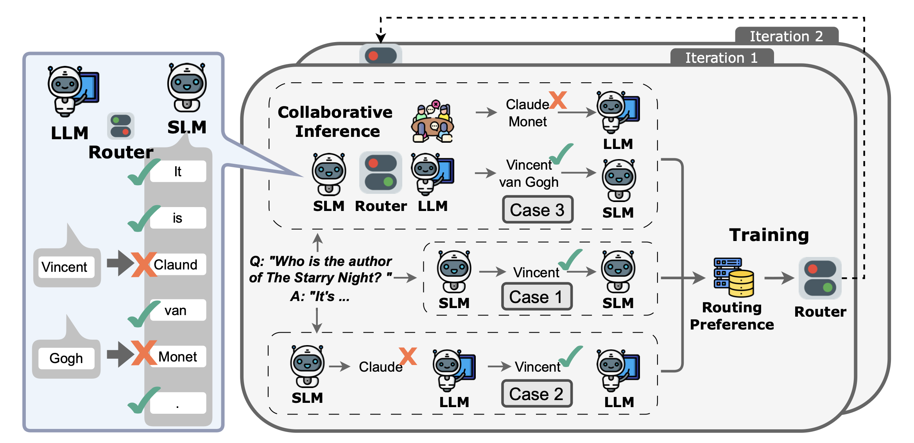

# CITER: Collaborative Inference for Efficient Large Language Model Decoding with Token-Level Routing

## Overview
CITER is a token-level collaborative inference framework designed for efficient decoding in large language models (LLMs). Unlike traditional query-level routing approaches, which assign entire prompts to either small or large models, CITER dynamically routes each token individually. Specifically, it employs a lightweight reinforcement-learning-based MLP router that inspects intermediate hidden states from a small language model (SLM) to predict token-level difficulty. Only tokens identified as challenging are forwarded to a larger, more capable model (LLM), substantially reducing memory bandwidth and computational costs.



## Requirements

Clone this repository and create a Conda environment from the provided configuration file:

```bash
git clone https://github.com/your_username/CITER.git
cd CITER
conda env create -f environment.yml
conda activate citer
```

## Data Format

CITER supports two types of datasets: multiple-choice (`mc`) and mathematical (`math`).

### Multiple-Choice (`mc`) Format

Each entry should include:

* `question`: The question text.
* `choices`: An object containing:

  * `text`: List of choice texts.
  * `label`: List of choice labels (e.g., \["A", "B", "C", "D"]).
* `answerKey`: Correct choice label.

Example:

```json
{
  "question": "What is the capital of France?",
  "choices": {
    "text": ["Berlin", "London", "Paris", "Rome"],
    "label": ["A", "B", "C", "D"]
  },
  "answerKey": "C"
}
```

### Mathematical (`math`) Format

Each entry should include:

* `problem`: The mathematical problem description.
* `solution`: The detailed solution to the problem, with the final numerical answer enclosed in a LaTeX box (e.g., `\boxed{2}`).

Example:

```json
{
  "problem": "Solve for x: 2x + 3 = 7.",
  "solution": "Subtracting 3 from both sides gives 2x = 4, hence x = \boxed{2}."
}
```

## Pipeline

### Step 1: Chain-of-Thought (CoT) Fine-tuning (Optional)

Fine-tune your small language model (SLM) with Chain-of-Thought training data.

```bash
python src/finetune/cot_finetune.py \
  --data_path path/to/cot_train_data.json \
  --deepspeed_path ds_config.json \
  --model_name Qwen/Qwen2-1.5B \
  --output_dir model/
```

### Step 2: Generate Initial Ground-Truth Data

Generate initial ground-truth labels comparing SLM and LLM outputs.

```bash
python src/pipeline/get_gt_first_iter.py \
  --cot_data path/to/cot_gt.jsonl \
  --large_model Qwen/Qwen2-72B \
  --small_model_path path/to/finetuned-model \
  --output_train train_iter_1.pkl \
  --output_analysis analysis_iter_1.pkl \
  --data_type mc
```

### Step 3: Train Confidence Router (MLP)

Train an MLP-based confidence router to decide token-level routing.

```bash
python src/pipeline/mlp_training.py \
  --data_path train_iter_1.pkl \
  --output_path model/mlp/ \
  --model_name Qwen/Qwen2-1.5B \
  --batch_size 64 \
  --learning_rate 1e-7
```

### Step 4: Refine Ground-Truth Labels (Optional)

Iteratively refine ground-truth token labels by leveraging the trained confidence router (MLP) to dynamically re-evaluate tokens previously misclassified by both the small and large models.

```bash
python src/pipeline/get_gt_next_iter.py \
  --gt_data_path train_iter_1.pkl \
  --small_model_path path/to/finetuned-model \
  --large_model Qwen/Qwen2-72B \
  --mlp_model model/mlp/mlp_model.pth \
  --output_train train_iter_2.pkl
```

### Step 5: Token-Level Routing Inference

Run inference using the trained router to optimize token generation.

```bash
python src/pipeline/token_route.py \
  --dataset_path path/to/test.jsonl \
  --small_model path/to/finetuned-model \
  --large_model Qwen/Qwen2-72B \
  --tokenizer Qwen/Qwen2-1.5B \
  --mlp_model model/mlp/mlp_model.pth \
  --threshold 0.9 \
  --batch_size 32 \
  --data_type mc \
  --output_file results.jsonl
```


## Citation

If you find our method helpful, please cite our paper:

```bibtex
@article{zheng2025citer,
  title={CITER: Collaborative Inference for Efficient Large Language Model Decoding with Token-Level Routing},
  author={Zheng, Wenhao and Chen, Yixiao and Zhang, Weitong and Kundu, Souvik and Li, Yun and Liu, Zhengzhong and Xing, Eric P and Wang, Hongyi and Yao, Huaxiu},
  journal={arXiv preprint arXiv:2502.01976},
  year={2025}
}
```